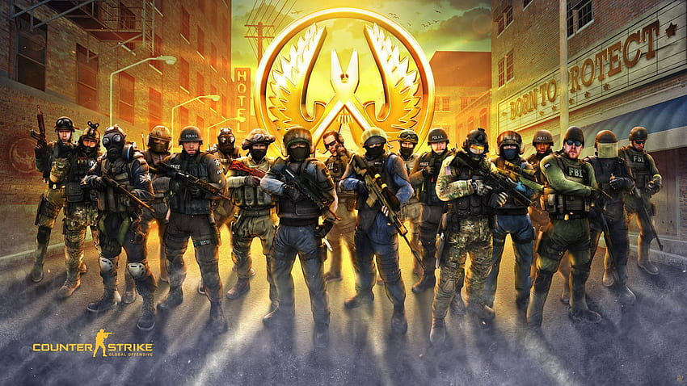

# CSGOProPlayersAnalysis

Problem Statement
---------------------------
Given a dataset containing detailed statistics of CS:GO professional players across various matches, including metrics such as kills, deaths, assists, headshot percentage, accuracy, round win rate, and match outcomes, develop a predictive model to forecast individual player performance or team success in future MAJOR matches. Additionally, identify key performance indicators (KPIs) that strongly correlate with overall player or team effectiveness, and provide actionable insights to coaches and players for optimizing strategies, player roles, and training regimens based on data-driven analysis.

Dataset Source
---------------------------
https://www.hltv.org/results

Contribution
---------------------------
- [Lim Jing Jie](https://github.com/bron322)
- [Ng Yuen Herng](https://github.com/ngyh6726)
- [Prakritipong Phuvajakrt](https://github.com/Phuvj)
